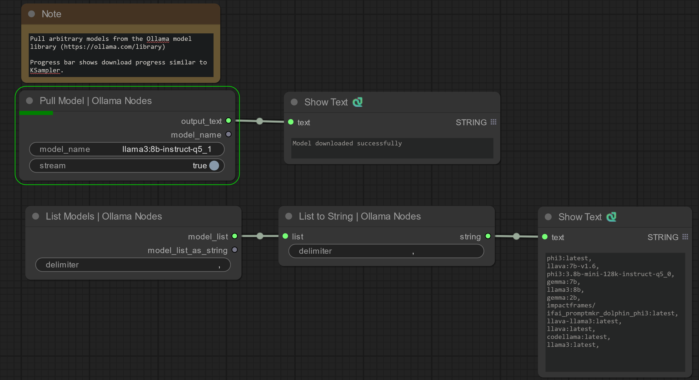
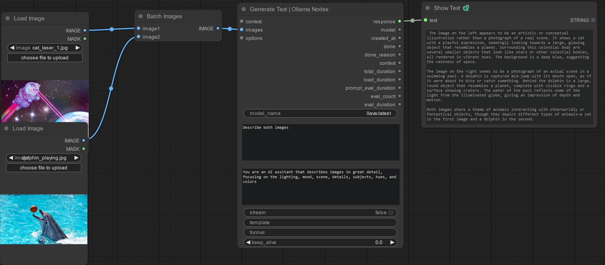

    

# comfyui-ollama-nodes

Add LLM workflows, including image recognition (vision), to ComfyUI via [Ollama](https://github.com/ollama/ollama)

Currently, it assumes that an Ollama server is running at `http://127.0.0.1:11434` and accessible by the ComfyUI backend.

## Screenshots

Pulling models from the [Ollama Model Libary](https://ollama.com/library) with download progress bar:

Generating text descriptions of loaded images:

## TODO:
- [X] Implement model pulling node
    - [x] Implement UI progress bar updates when pulling with `stream=True`
- [x] Impelement Huggingface Hub model downloader node
    - [ ] Implement progress bar updates when download models
- [x] ~~Implement model loading node~~ Theyre loaded dynamically on generate, it's good to unload them from GPU to leave room for image generation models in the same workflow.
- [x] Implement generate node
- [ ] Impelment generate node with token streaming (I think it's just a UI limitation with ShowText class)
- [x] Implement generate node with vision model (can take image batch as input!)
- [ ] Implement chat node (likely requires new frontent node development)
- [ ] Implement [model converter](https://github.com/ggerganov/llama.cpp/discussions/2948) node (saftetensor to GGUF)
- [ ] Implement quantization node
- [ ] Test compatability with SaltAI LLM tools (LlamaIndex)

## Similar Nodes
The following node packs are similar and effort will be made to integrate seemlessly with them:
- https://github.com/daniel-lewis-ab/ComfyUI-Llama
- https://github.com/get-salt-AI/SaltAI_Language_Toolkit
- https://github.com/alisson-anjos/ComfyUI-Ollama-Describer

## Development

If you'd like to contribute, please open a Git Issue describing what you'd like to contribute. See ComfyOrg docs for instructions on getting started [developing custom nodes](https://docs.comfy.org/essentials/custom_node_overview).

## Attributions

- logger.py taken from https://github.com/Kosinkadink/ComfyUI-VideoHelperSuite, GPL-3.0 license
- [Ollama](https://github.com/ollama/ollama) MIT license, based on [llama.cpp](https://github.com/ggerganov/llama.cpp) MIT license
- [huggingface_hub](https://github.com/huggingface/huggingface_hub) python library Apache-2.0 license